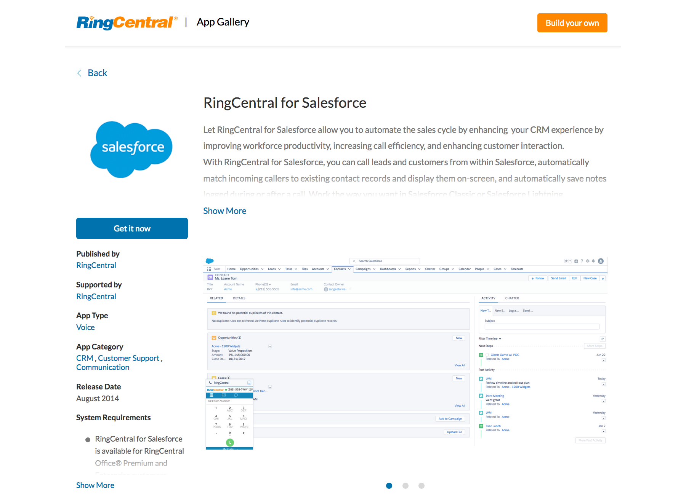
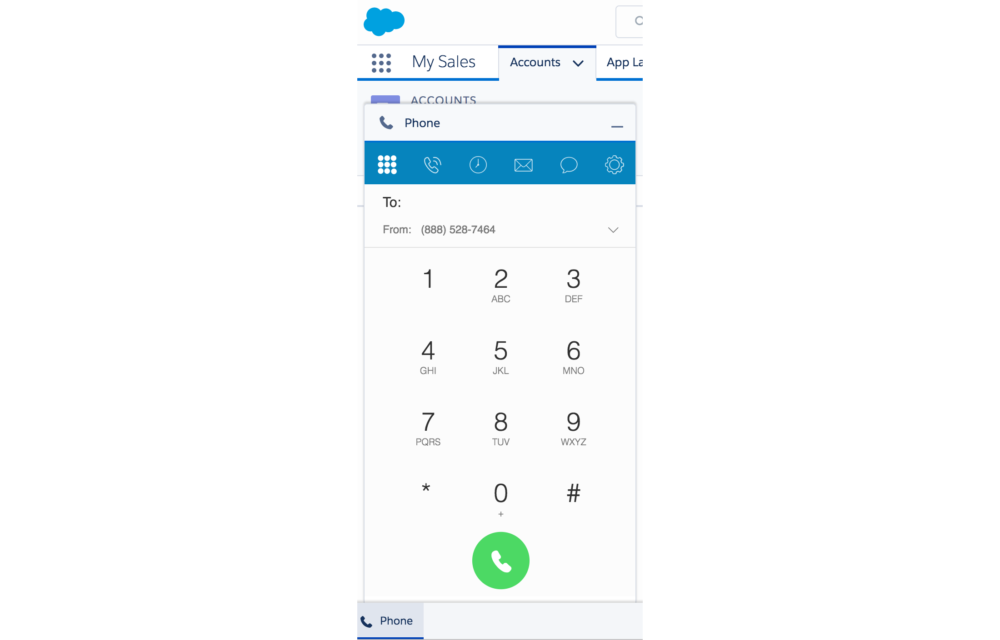
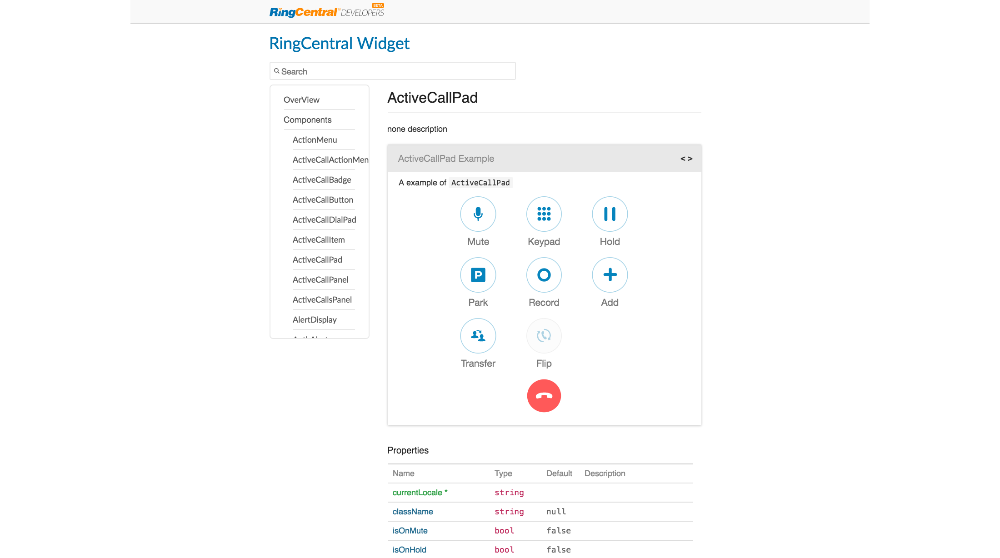
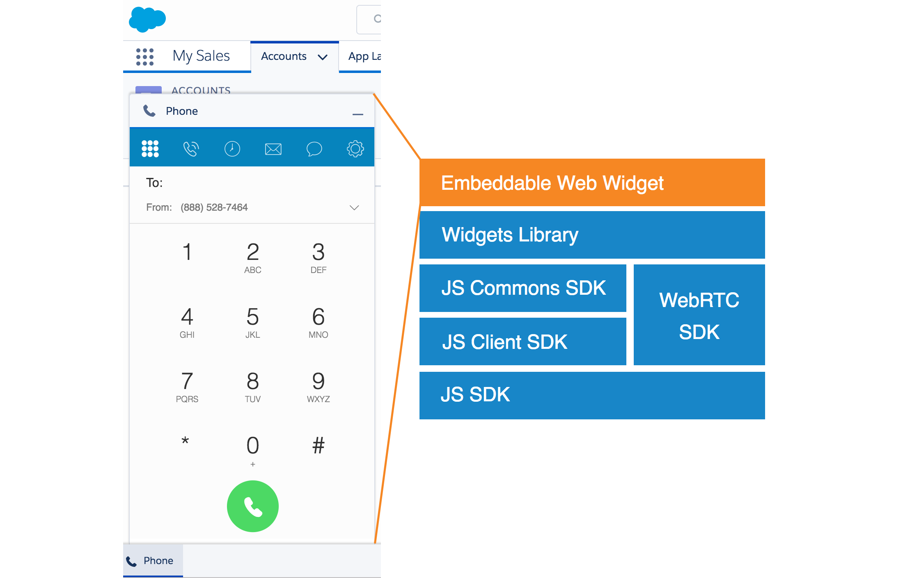
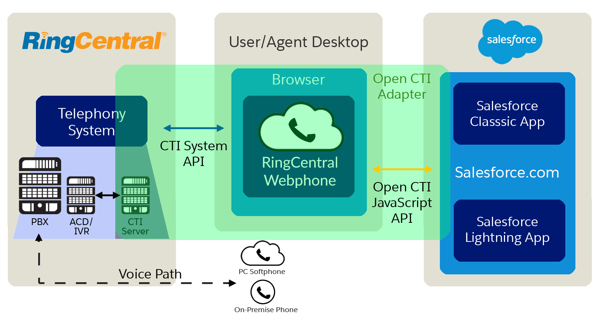

## Add CTI in 15 Minutes with the RingCentral Web Widget

John Wang


Note: I'm John Wang, Sr. Director of Platform for RingCentral and we are going to talk about how to add CTI quickly to your apps in just 15 Minutes with the Web Widget and why this is important.

---

# Why CTI?

<div class="fragment" data-fragment-index="1">**Organizational Drag**</div>
<div class="fragment" data-fragment-index="2">Context Switching</div>
<div class="fragment" data-fragment-index="3">Inadequate Information</div>
<div class="fragment" data-fragment-index="4">Slow Response Time </div>

Note:

* Problem - Organizational Drag
  * Context Switching
  * Inadequate Information
  * Slow Response Time

Our top use case at RingCentral

---

## What is CTI?



Note:

The Solution - CTI

Integrating communications directly into your app, not just for calling but a deep integration with **linked functionality**

  * Better Customer Experience
  * Improved Employee Productivity & Efficiency
  * Boosts ROI of CRM
  * Connects with many systems
  * Installs easily and quickly

These are the most popular apps on our app gallery.
  * It can take months to build this.
  * We are going to help you build it faster.

---

## The RingCentral Web Widget



[github.com/ringcentral/ringcentral-widget-demo](https://github.com/ringcentral/ringcentral-widget-demo)

Note:

We are giving you our entire web app so you don't have to build it yourself.

This is useful for two things:

* Building out integrations for your CRM and helpdesk apps. There are over 500 of these.
* Customizing what you want. For example, a customer asked for Salesforce + RingCentral + Google

We are going to talk about the widget and show you how to add this to Salesforce in 15 minutes.

---

## Web Widgets Library



Note:

While the web widget gives you an entire embeddable web app, the widget library allows you to compose your own UI for more flexibility.

---

## Agenda

<div class="fragment" data-fragment-index="1">The Web Widget</div>
<div class="fragment" data-fragment-index="2">Lab #1 - Static HTML</div>
<div class="fragment" data-fragment-index="3">Lab #2 - Salesforce Open CTI</div>
<div class="fragment" data-fragment-index="4">Lab #3 - Salesforce + Google</div>

---

## Web Widget Stack



Note:

The widget you see is actually a number of open source libraries that work together. The entire web widget is an impleentation of the widget library.

* Out of the box widget you can embed right aways
* Set of UI Components

---

## Web Widget Capabilities

* WebRTC
* SMS
* Click-to-Dial
* Inbound Screen Pop
* Call Logging

---

## Lab #1: Static HTML Demo

* Install widget on static HTML webpage
* Configure click-to-dial

---

## Static HTML App Configuration

* Permissions: VoIP Calling, SMS, Read Accounts, Edit Messages, etc.
* OAuth Grants: Authorization Code
* App Type: Browser-based

---

## Add the Web Widget

Add the RingCentral webphone simply by adding `adapter.js` to web page

```html
<p><a href="tel:+16505550100">(650) 555-0100 - Tel</a></p>
<p><a href="sms:+16505550101">(650) 555-0101 - SMS</a></p>

<script>
    (function() {
      var rcs = document.createElement("script");
      rcs.src = "https://embbnux.github.io/ringcentral-widget-demo/adapter.js";
      var rcs0 = document.getElementsByTagName("script")[0];
      rcs0.parentNode.insertBefore(rcs, rcs0);
    })();
</script>
```

[ringcentral.github.io/ringcentral-widget-demo](https://ringcentral.github.io/ringcentral-widget-demo/)

---

## Lab #2: Salesforce Open CTI Demo

Note:

Now let's look at a more in-depth use case, connecting this to Salesforce. We'll use Salesforce because

* it is a popular, well known CRM and
* customers often ask us to customize our integration

---

## RingCentral and Salesforce



Note:

RingCentral and Salesforce connect via a framework called Open CTI by Salesforce. It has a number benefits including that it is entirely web-based and can be deployed quickly which we'll do next.

---

### Lab Steps

* Configure Salesforce
* WebRTC Calls
* Click-to-Dial
* Inbound Screen-Pop
* Call-Logging

---

### Lab Prerequisites

* Accounts
  * RingCentral: Office or Developer
  * Salesforce: Dev Edition, Pro or above
* App Configuration
  * Permissions: VoIP Calling, SMS, Read Accounts, Edit Messages, etc.
  * OAuth Grants: Authorization Code
  * App Type: Browser-based

Note:

You should have these set up already.

---

### Configure Salesforce

* Salesforce Call Center
* Visualforce Page
* Apex Helper Class

---

### Creating the Call Center

* Create a Call Center with `salesforce_CallCenterDefinition.xml`
* This uses the `/apex/RCPhone` CTI Adapter URL

```xml
<callCenter>
  <section sortOrder="0" name="reqGeneralInfo" label="General Information">
    <item sortOrder="0" name="reqInternalName" label="Internal Name">RingCentralAdapterOpenCTI</item>
    <item sortOrder="1" name="reqDisplayName" label="Display Name">RingCentral Call Center Adapter Open CTI</item>
    <item sortOrder="2" name="reqAdapterUrl" label="CTI Adapter URL">/apex/RCPhone</item>
    <item sortOrder="3" name="reqUseApi" label="Use CTI API">true</item>
    <item sortOrder="4" name="reqSoftphoneHeight" label="Softphone Height">550</item>
    <item sortOrder="5" name="reqSoftphoneWidth" label="Softphone Width">300</item>
    <item sortOrder="6" name="reqSalesforceCompatibilityMode" label="Salesforce Compatibility Mode">Lightning</item>
  </section>
</callCenter>
```

[salesforce_CallCenterDefinition.xml](https://github.com/grokify/ringcentral-web-widget-demo/blob/master/salesforce_CallCenterDefinition.xml)

Note:
* A Salesfore Call Center is used to connect a CTI (computer-telephony integration)
* Users must be assigned to a call center to use a CTI such as RingCentral Web Widget

Steps

* Setup > Search - Call Center
* Clone Repo
* Open File in VS Code to look at RCPhone URL
* Import File
* Add Users

---

## Create the Webphone Visualforce page

Create an a VF page with iframe to the widget named `RCPhone` to handle calls.

```html
<apex:page>
    <style>
        .hasMotif {
            margin : 0px;
        }
    </style>
    <apex:iframe src="https://ringcentral.github.io/ringcentral-widget-demo/app.html" height="500" width="300" frameborder="false"/>
</apex:page>
```

Note:

Steps

* Developer Console
* New Visualforce Page - Name: RCPhone

---

## Enable the Salesforce App

* Add the Webphone
* Make a call!

Note:

* Setup > search (App Manager)
* Edit Sales Lightning App
* Add Utility Bar Item "Open CTI Softphone"
* Select All Items
* Assign to all User Profiles
* Select Test App and open phone

---

### Click-to-Dial VF Page

Add the following to the RCPhone VF page:

```html
<script src="/support/api/40.0/lightning/opencti_min.js"></script>
<script>
   function postMessage(data) {
       document.getElementsByTagName('iframe')[0].contentWindow.postMessage(data, '*');
   }  
   sforce.opencti.enableClickToDial();
   sforce.opencti.onClickToDial({
       listener: function(result) {
           postMessage({
               type: 'rc-adapter-new-call',
               phoneNumber: result.number,
               toCall: true,
           });
           sforce.opencti.setSoftphonePanelVisibility({ visible: true });
       }
   });
</script>
```

Click a phone number to make a call!

---

### Inbound Screen Pop - Part 1 - Apex

* Create an APEX class `RCPhoneHelper`

```cs
global class RCPhoneHelper {

    // Inbound Screen Pop
    webService static Contact searchContact(String phone) {
        List < List < SObject >> l = [FIND: phone IN PHONE FIELDS RETURNING Contact(Id limit 1)];
        if (l.size() > 0 && l[0].size() > 0) {
            return (Contact) l[0][0];
        }
        return null;
    }
}
```

---

### Inbound Screen Pop - Part 2 - JS

* Add the `searchContact(String phone)` method

```html
function receiveMessage(event) {
    if (event.data.type === 'rc-call-ring-notify') {
        sforce.opencti.setSoftphonePanelVisibility({
            visible: true
        });
        var fromNumber = event.data.call.from;
        if (fromNumber[0] === '+') {
            fromNumber = fromNumber.substring(1);
        }

        sforce.opencti.runApex({
            apexClass: 'RCPhoneHelper',
            methodName: 'searchContact',
            methodParams: 'phone=' + fromNumber,
            callback: function(response) {
                if (response.success == true) {
                    var contactId = response.returnValue.runApex.Id;
                    if (contactId !== null) {
                        sforce.opencti.screenPop({
                            type: sforce.opencti.SCREENPOP_TYPE.SOBJECT,
                            params: {
                                recordId: contactId
                            }
                        });
                    }
                }
            }
        });
    }
}
window.addEventListener("message", receiveMessage, false);
```

Call the user to receive an screen-pop!

---

### Call Logging - Part 1 - Apex

```cs
// Call Logging
webService static void logACall(string contactId, Integer duration, String fromNumber, String toNumber) {
    Task t = new Task(
        ActivityDate = date.today(),
        CallDurationInSeconds = duration,
        CallType = 'Inbound',
        Description = 'From: ' + fromNumber + '\nTo: ' + toNumber + '\nDuration: ' + duration + ' seconds',
        Status = 'Completed',
        Subject = 'Call log',
        TaskSubtype = 'Call',
        Type = 'Call',
        WhoId = contactId
    );
    insert t;
}
```

---

### Call Logging - Part 2 - JS

```js
else if (event.data.type === 'rc-call-end-notify') {
    if (event.data.call.startTime !== null) {
        var fromNumber = event.data.call.from;
        if (fromNumber[0] === '+') {
            fromNumber = fromNumber.substring(1);
        }
        sforce.opencti.runApex({
            apexClass: 'RCPhoneHelper',
            methodName: 'searchContact',
            methodParams: 'phone=' + fromNumber,
            callback: function(response) {
                if (response.success == true) {
                    var contactId = response.returnValue.runApex.Id;
                    if (contactId !== null) {
                        sforce.opencti.runApex({
                            apexClass: 'RCPhoneHelper',
                            methodName: 'logACall',
                            methodParams: 'contactId=' + contactId +
                                '&duration=' + Math.round((event.data.call.endTime - event.data.call.startTime) / 1000) +
                                '&fromNumber=' + event.data.call.from +
                                '&toNumber=' + event.data.call.to,
                            callback: function(rr) {
                                console.log(rr);
                            }
                        });
                    }
                }
            }
        });
    }
}
```

Log a call!

---

## Lab #3: Salesforce + Google

## Be a CTI Hero

---

## Google Screen-Pop in One Line

```js
window.open('https://www.google.com/search?q=' + contact.Name);
```

---

## Web Widget Libraries

github.com/ringcentral

* Web Widget Demo: [ringcentral-widget-demo](https://github.com/ringcentral/ringcentral-widget-demo)
* Widgets Library: [ringcentral-js-widget](https://github.com/ringcentral/ringcentral-js-widget)
* JS Commons SDK: [ringcentral-js-integration-commons](https://github.com/ringcentral/ringcentral-js-integration-commons)
* JS Client SDK: [ringcentral-js-client](https://github.com/ringcentral/ringcentral-js-client)
* WebRTC SDK: [ringcentral-web-phone](https://github.com/ringcentral/ringcentral-web-phone)
* JS SDK: [ringcentral-js](https://github.com/ringcentral/ringcentral-js)

Note: Here's a list of the web widget and supporting libraries you can use.

We are big proponents of support open source and all of these are free for you to use.

---

## Continue the Journey

RingCentral Developers
* Dev Portal: https://developer.ringcentral.com
* Community: https://devcommunity.ringcentral.com
* Twitter: https://twitter/RingCentralDevs
* Github: https://github.com/ringcentral

John Wang
* Twitter: https://twitter.com/grokify
* Github: https://github.com/grokify